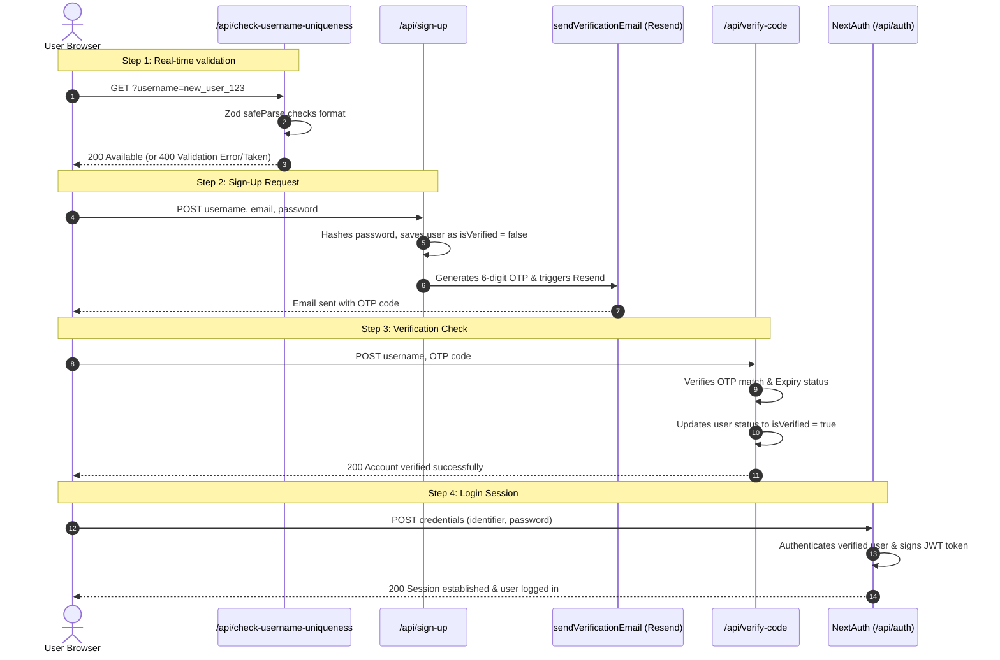
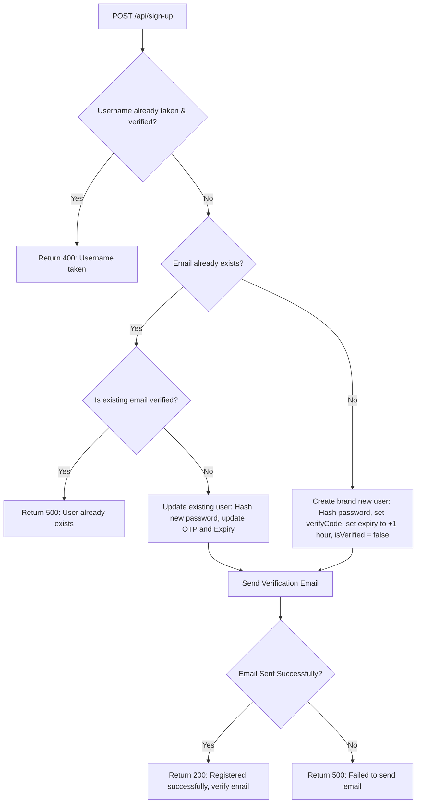
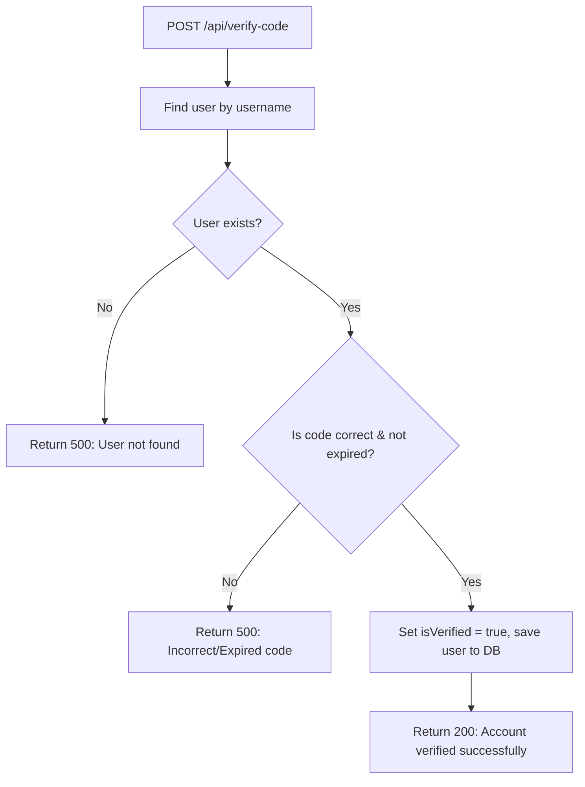

# Mystry Message: Complete Authentication, Validation & Verification Notes

This is the master guide documenting the complete authentication architecture, data flows, validation layers, and email verification pipeline for the Mystry Message project.

---

## 1. The Big Picture: Integrated Authentication Sequence

Below is the end-to-end sequence of how the client browser, API endpoints, database, and email services work together:



---

## 2. Zod Validation & Schema Layer (`src/app/schemas/`)

Zod is a TypeScript-first schema declaration and validation library. It is used in this project to validate input formats on the backend at runtime before querying MongoDB.

### A. Username Validation Schema (`signUpSchema.ts`)
We define rules specifically for checking usernames so they can be reused across different endpoints:
```typescript
export const usernameValidation = z
  .string()
  .min(8, "Username must be atleast 8 characters")
  .max(20, "Username must be at most 20 characters")
  .regex(/^[a-zA-Z0-9_]+$/, "Username must not contain special character")
  .regex(/[a-zA-Z]/, "Username must contain at least one letter");

export const signUpSchema = z.object({
  username: usernameValidation,
  email: z.email({ message: "Invalid email address" }),
  password: z.string().min(8, { message: "password must contain atleast 8 characters" })
});
```

### B. Verify Schema (`verifySchema.ts`)
Validates that incoming OTP verification codes are exactly 6 characters long:
```typescript
export const verifySchema = z.object({
  code: z.string().length(6, "Verification code must be 6 digits")
});
```

---

## 3. Check Username Uniqueness (`/api/check-username-uniqueness/route.ts`)

This endpoint runs validation checks instantly on keypress/debounced inputs in the signup form.

* **Zod `safeParse`**: Validates the input without throwing errors or halting execution. It returns a result object containing status.
* **Error Formatting**: If validation fails, we extract structured error messages to send back:
  ```typescript
  const result = UsernameQuerySchema.safeParse({ username })
  if (!result.success) {
      const usernameErrors = result.error.format().username?._errors || []
      return Response.json({
          success: false,
          message: usernameErrors.join(", ")
      }, { status: 400 })
  }
  ```
* **Database Check**: If the format is valid, it checks if a user is **already verified** under this name:
  ```typescript
  const existingVerifiedUser = await UserModel.findOne({ username, isVerified: true })
  ```

---

## 4. Sign-Up Registration (`/api/sign-up/route.ts`)

When a user submits the signup form, a POST request is processed through this route:



### Key Logic Steps:
1. Checks if the username exists and is verified (`isVerified: true`). If yes, registration fails.
2. Checks if the email is already in the database:
   * **If Email is Verified**: Fails registration.
   * **If Email is Unverified**: Overwrites the user's password with the newly hashed password, generates a new verify code, resets the expiration time to +1 hour, and updates the existing document.
   * **If Email is New**: Creates a new user record with `isVerified: false` and a random OTP.
3. Invokes the `sendVerificationEmail` helper.

---

## 5. Verification Email Sender Helper (`src/helpers/sendVerificationEmail.tsx`)

This helper handles rendering the React email template and calling the Resend API to deliver the email.

```typescript
export async function sendVerificationEmail(
    email: string,
    username: string,
    verifyCode: string
): Promise<ApiResponse> {
    try {
        await resend.emails.send({
            from: 'onboarding@resend.dev',
            to: email,
            subject: "Mystry message | Verification Code",
            react: <VerificationEmail username={username} otp={verifyCode} />
        });
        return { success: true, message: "Verification email sent successfully" }
    } catch (err) {
        return { success: false, message: "Failed to send verification email" }
    }
}
```

* **Resend Integration**: Awaits the `.send()` call.
* **React Template (`emails/VerificationEmail.tsx`)**: Renders a visually styled email box with a clean accent layout, containing the user's name and the OTP code.

---

## 6. Code Verification (`/api/verify-code/route.ts`)

Verifies the 6-digit OTP code entered by the user.



### Validation Checks:
1. **Decode Username**: Decode string parameters (`decodeURIComponent(username)`) from query/payload safely.
2. **Code Validation**: Checks if the user's code matches the entered code:
   `user.verifyCode === code`
3. **Expiry Check**: Verifies that the current timestamp is less than the saved code expiry date:
   `new Date(user.verifyCodeExpiry) > new Date()`
4. **Mark Verified**: Sets `isVerified = true` and persists it using `await user.save()`.

---

## 7. Sign-In Flow (`src/app/api/auth/[...nextauth]/options.ts`)

NextAuth processes requests to `/api/auth/*` dynamically using the credentials login strategy.

### NextAuth Workflow Steps:
1. **Credentials Provider**: Defines credentials required (email/username identifier and password).
2. **Authorize Method**:
   * Connects to the database and finds the user using the identifier (matches either `email` or `username`).
   * **Verification Check**: Throws an error if `!user.isVerified`.
   * **Password Comparison**: Verifies credentials by comparing inputs with the hashed database password:
     ```typescript
     const isPasswordCorrect = await bcrypt.compare(credentials.password, user.password)
     ```
3. **JWT Callback**: Packs custom user values (`_id`, `username`, `isVerified`, `isAcceptingMessages`) into the JSON Web Token.
4. **Session Callback**: Extracts fields from the JWT and links them to the client's session state.
5. **Session Strategy**: Uses stateless `"jwt"` sessions stored securely in encrypted client cookies.
